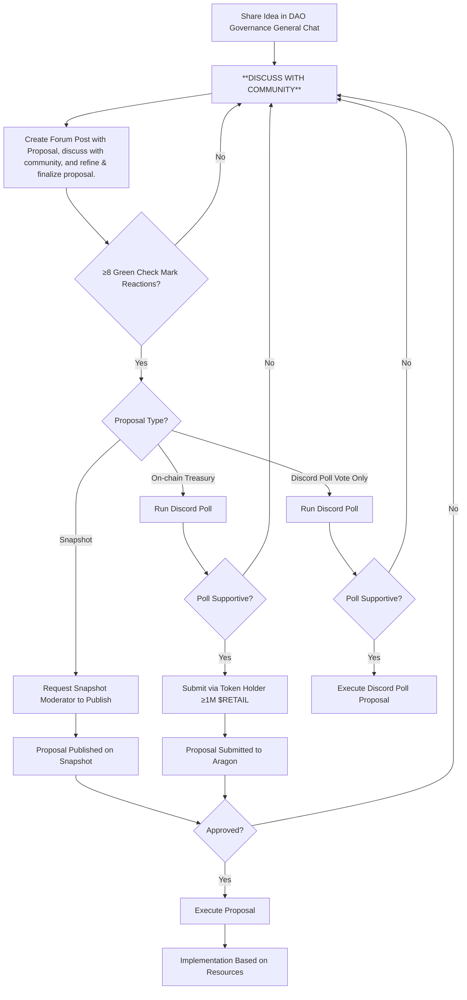

# DAO Proposal Guidelines

The proposal process is a living document, subject to updates by admins or through community proposals. The Genesis Proposal established the initial outline, with the latest version updated on November 25, 2024. Refer to the Discord Governance Forum Rules for the detailed Step-by-Step Process and Initial Proposal Guidelines.

## Step-by-Step Process: From Idea to Proposal

1. **Share Your Idea**: Post your idea in the Discord Governance Forum's *DAO Governance General Chat* channel.
2. **Discuss and Refine**: Engage with community members to gather support, feedback, and flesh out details.
3. **Create a Forum Post**: Draft a detailed proposal in a new Forum Post.
4. **Gather Support**: Further discuss and refine the proposal with the community to a finalized version and ensure the Forum Post receives at least 8 “green check mark” reactions to proceed.
   - For **On-chain Treasury proposals**, a Discord poll is required first.
   - For **Snapshot proposals**, if requirements are met, request a Snapshot moderator to publish directly.
5. **Submit Proposal**:
   - You may need a Snapshot moderator or a $RETAIL “whale” (holder of ≥1M tokens) to submit on your behalf.
   - For On-chain Treasury proposals, a token holder with at least 1 million $RETAIL tokens must submit it.
6. **Execution**: Approved proposals are implemented based on available resources.

## Proposal Guidelines

A proper proposal should include:

- **Concrete Title**: Capture the essence of the proposal.
- **Concise Summary**: Provide a brief overview.
- **Motivation**: Clearly explain why the proposal is necessary.
- **Detailed Explanation**: Elaborate on the proposal. If space is limited in the Forum Post, add details in comments or upload a document for complex proposals.
- **Pros and Cons**: Acknowledge both advantages and potential drawbacks.
- **Execution Team**: Specify who will execute the proposal (individuals or team) and who is in charge.
- **Timeline**: Include an execution timeline and, if applicable, milestones.
- **Payment Terms** (if applicable): Specify whether payment is upfront, upon completion, or another arrangement.
- **Feasibility**: Ensure the proposal is both technically and financially feasible.

## Publication and Implementation

- Proposals must include options to **reject** the changes and **abstain** from voting.
- Each new poll or proposal must be announced in a dedicated *polls* or *proposals* channel, including a link to the proposal’s Forum discussion thread.
- Implementation depends on the network’s available resources.

## Proposal Requirements for Spending

- **Discord Polls**: For proposals involving up to 100,000 $RETAIL tokens.
- **Snapshot**: For proposals involving  >100,000–1,000,000 (and including) $RETAIL tokens.
- **Aragon**: For proposals involving more than 1,000,000 $RETAIL tokens (requiring prior support from a Discord poll).

Approved spending proposals via off-chain voting (Discord polls or Snapshot) are executed through the **Multisig Wallet**, subject to available unallocated funds. If insufficient funds are available, the proposal must be submitted directly to the **On-chain Treasury** on Aragon.

## Proposal Lifecycle Visualization

Below is a flowchart illustrating the lifecycle of a DAO proposal:

