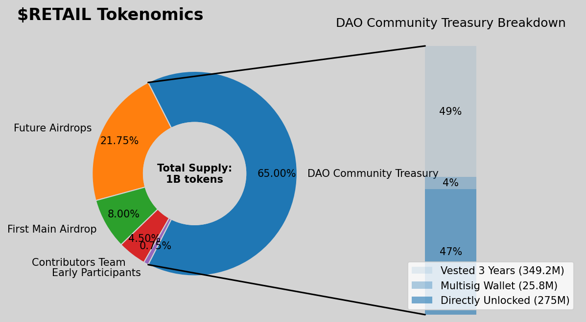

# Tokenomics 

## 65% DAO Community Treasury:

*275M* $RETAIL directly unlocked in Treasury atGenesis allocation.
*25.8M* $RETAIL stays in the Multisig Wallet for budget expenses and for off-chain proposals.
*349.2M* $RETAIL vested over 3 years, which means an average monthly release to the Treasury of 9,700,000 tokens. (release may take place once per trimester shortly before a new budget period starts.) 

## 21.75% Destined for 4 future Airdrops.
Held in reserve by the multisig wallet. Goal is every 3-4 months after the First Airdrop.

## 8% First Main Airdrop. *80M* $RETAIL tokens.
Check the full Genesis Proposal [Here](https://drive.google.com/file/d/1-XDNcRzCSQuPiqqDBGSoRhvyyCkpBDOv/view)

## 4.5% Contributors Team: Two-tier system:
1.- Medium tier: *20M* tokens for 10-15 contributors (~*1-3M* tokens each)
2.-Highest Tier: *25M* tokens split among entities.
    *EXCLUDED from XP-leveling rewards.*

## Addresses from retroactive Airdrop
:::info
**Specification:** _84 wallets_ receive an aggregate total of **52,499,988 tokens**.
Early Participants receive a reward based on their Level Role in Discord. The list of Early
Participants is based on a Discord snapshot of the Leaderboard performed on: November 7,
2024.
:::
**Specification of high value DAO Members that receive larger distributions, not based on XP
Level Roles:**
- Coinsider Team: 11 million
- CryptoEQ Team: 10 million
- Full Value Dan: 4 million
- TripleTres: 4 million
- Starskie: 3 million
- Strokeontent: 3 million
- Arcadelights: 3 million
- Merivercap: 3 million
- CH Egan: 1 million
- Gauthier: 1 million
- Tibarn: 1 million
- Dadofking: 1 million

**You can find a full report with all addresses [_here_](https://drive.google.com/file/d/10hmYN4MR_zlI7M9XJHQpxQdlWgP_erSI/view) as well as it's '$RETAIL' Token allocation.** 

## 0.75% For Early Participants:
Based on Discord activity and level role status (accumulative):

  1. Level 1: 2.5M tokens
  2. Level 2: 2M tokens
  3. Level 3+: 1.5M Tokens
  4. Level 5+: 1M tokens
  5. Level 10+: .5M tokens

- ## **Inflation/Deflation**: 
:::note
Originally, it was proposed a 2% yearly inflationary scheme after the third year, mainly because of Aragon's Framework limitations of removing the active 'Mint_' function in our contracts architecture.
For more Details about this Governance actions, and updates pleas refer to [Bricking_OG_DAO](./bricking_OG_DAO) 
:::
