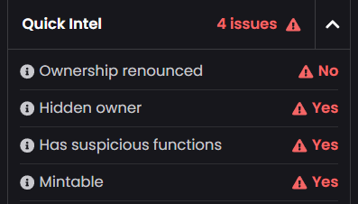
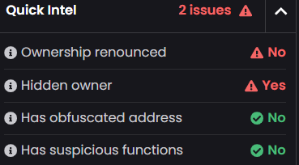

# Bricking the OG Token Mint DAO for Retail DAO 

:::info
 Summary :scroll:

After setting up liquidity pool positions on Uniswap V4 our $RETAIL token was flagged by [Dexscreener](https://dexscreener.com/base/0x7379613ac32b58012f2fb52439228053f51897e3f0a68208587e51bfbfc3eb7f) due to concerns about the mint function and ownership structure of our current original DAO (OG Token Mint DAO) used to mint 1B '$RETAIL' tokens.

_Flags as displayed on Dexscreener_

 After conducting an audit and consulting with [Aragon's support team](https://aragon.org/), we addressed these concerns by "Bricking" the OG Token Mint DAO, which was used to mint the $RETAIL token. This process will revoke all execution permissions, rendering the OG Token Mint DAO immutable and **capping the $RETAIL token supply at 1 billion tokens**, ensuring no further minting is possible. The $RETAIL token is linked to our current governance DAO, which operates with a treasury wallet, governed by on-chain token weighted voting. And the mint function is only destined to be used after the 3rd year, but keeping "Active" such function, flags our token with potential value dilution due to inflation. But we are currently addressing this challenge:

This document outlines the deployment of the OG Token Mint DAO, the audit findings, the bricking process, and the benefits of a non-inflationary and immutable token supply.

Update: After the OG Token Mint DAO was successfully bricked, we were able to remove 2 alerts so far.

_Flags as displayed on Dexscreener after bricking the OG DAO Token Mint_
:::

## Background and Audit Findings :mag:

In November 2024, Retail DAO deployed its OG Token Mint DAO on the Base blockchain using the Aragon framework to mint 1 billion $RETAIL tokens. To enable minting, Aragon by default installed `IVotes` plugin on that DAO, which granted that [OG Token Mint DAO](https://app.aragon.org/dao/base-mainnet-0xcbFaabb2b87E858717a52216439276956dc1C9eC/settings/dashboard) minting permissions. The minted tokens were then transferred to a multisig wallet ([Multisig Contract Address: 0x989bbb17742c07a6053ffe8eb0be190887aa2bbf](https://basescan.org/address/0x989bbb17742c07a6053ffe8eb0be190887aa2bbf)) for secure distribution of airdrops, rewards, grants and other token spending proposals. The remain $RETAIL tokens were linked to our current governance DAO ([Current DAO Contract Address: 0xc7167e360bd63696a7870c0ef66939e882249f20](https://basescan.org/address/0xc7167e360bd63696a7870c0ef66939e882249f20)), with a Treasury wallet independently governed by on-chain, token weighted voting by token holders, and to a vesting contract linked to that governance DAO which will unlock tokens for the Treasury periodically.

The Aragon framework and our deployment process led to several issues flagged by common DEX and AI scanners:

1. **Active Mint Function**: The OG DAO retained an active mint function due to the `IVotes` plugin with 'execute()'permissions, raising concerns about potential token supply inflation.
2. **Non-Standard Ownership**: Aragon's framework does not follow the standard `Ownable` contract pattern (e.g., `ownership()` and `renounceOwnership()`), preventing public renouncement of ownership in a verifiable way. This made Retail DAO appear to have a "hidden owner."
3. **Proxy Contracts**: The use of proxy contracts during the OG Token Mint DAO and token deployment obscured the transparency of the control structure.
4. **Outdated Token Metadata**: The token metadata on [Basescan](https://basescan.org/) its still not up to date with current ownership information due to prior confirmation issues, further reducing perceived transparency.

For detailed audit findings, refer to our [audit report](./audits.md).

## Bricking the OG DAO :gear:

To address these concerns and ensure the integrity of Retail DAO, we consulted with Aragon's support team, who recommended "bricking" the OG Token Mint DAO. This process permanently disables the OG Token Mint DAO's ability to execute actions. The steps taken were:

1. **Revoking `execute()` Permissions**: All permissions to call the `execute()` function on the OG Token Mint DAO ([OG Token Mint DAO](https://app.aragon.org/dao/base-mainnet-0xcbFaabb2b87E858717a52216439276956dc1C9eC/settings/dashboard)) were revoked. This ensures the DAO cannot perform any actions, including minting new $RETAIL tokens or re-granting permissions.
2. **Immutable OG DAO**: By removing all execution capabilities, the OG Token Mint DAO is now fully immutable. No entity, including the original deployers, can interact with or modify its state.
3. **Capped Token Supply**: The $RETAIL token supply is permanently capped at 1 billion tokens ([Token Contract Address: 0xc7167e360bd63696a7870c0ef66939e882249f20](https://basescan.org/token/0xc7167e360bd63696a7870c0ef66939e882249f20)). No additional tokens can be minted, ensuring a non-inflationary token economy.
:::note
Since the $RETAIL token is linked to our current governance DAO, which operates with a treasury wallet, governed by on-chain token weighted voting, **bricking the OG Token Mint DAO does not affect our further governance operations.**
:::

## Benefits of Bricking the OG Token Mint DAO :sparkles:

Bricking the OG Token Mint DAO provides significant benefits to the Retail DAO ecosystem:

- **Non-Inflationary Token Supply**: The $RETAIL token supply is fixed at 1 billion tokens, eliminating the risk of inflation and providing certainty to token holders.
- **Immutability**: The OG Token Mint DAO's immutability ensures no unauthorized changes can be made, enhancing trust and security.
- **Decentralized Governance**: The current DAO, linked to the $RETAIL token, continues to manage governance transparently, supported by a secure treasury wallet, governed by on-chain, token weighted voting.

## Transparency and Next Steps :speech_balloon:

By bricking the OG Token Mint DAO, Retail DAO has resolved the concerns raised by Dexscreener and common scanners regarding the mint function and ownership structure. The $RETAIL token supply is verifiably fixed, and the OG Token Mint DAO's immutability guarantees no future modifications. We are working to update the outdated metadata on Basescan to reflect the current state of the contracts.

For further details, please refer to:
- [Audit Report](./audits.md)
- OG Token Mint DAO Contract: [0xcbFaabb2b87E858717a52216439276956dc1C9eC](https://app.aragon.org/dao/base-mainnet-0xcbFaabb2b87E858717a52216439276956dc1C9eC/settings/dashboard)
- $RETAIL Token Contract: [0xc7167e360bd63696a7870c0ef66939e882249f20](https://basescan.org/address/0xc7167e360bd63696a7870c0ef66939e882249f20)
- Current Governance DAO Contract: [0xc7167e360bd63696a7870c0ef66939e882249f20](https://basescan.org/address/0xc7167e360bd63696a7870c0ef66939e882249f20)
- Multisig Wallet Contract: [0x989bbb17742c07a6053ffe8eb0be190887aa2bbf](https://basescan.org/address/0x989bbb17742c07a6053ffe8eb0be190887aa2bbf)

Retail DAO remains committed to transparency, decentralization, and community-driven governance. For questions or further clarification, please reach out via our official channels.
