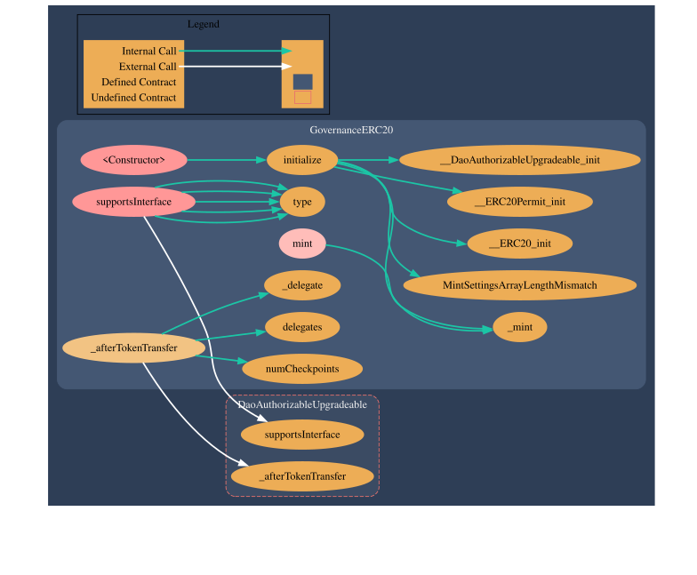
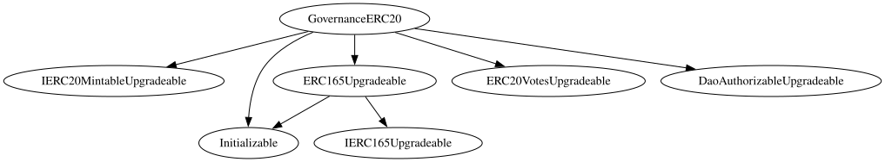

# Retail DAO Technical Specifications :gear:

This document outlines the technical architecture of Retail DAO, including smart contracts, token, governance, and infrastructure, ensuring transparency and developer accessibility.

## Smart Contracts :robot:
- **Version**: Solidity 0.8.17
- **Framework**: Aragon's default for development, testing, and deployment.

- **Standards**:
  - ERC-20: For '$RETAIL' token
  - ERC-165: Allows the contract to declare which interfaces it supports (useful for contract introspection).
  - Aragon OSx: For modular governance via Aragon's Plugin Framework
  - OpenZeppelin: For secure contract templates (like `Math.sol`, `IVotes.sol`)

:::note
Our main smart contract are currently locked to a specific Solidity version:
```solidity
pragma solidity 0.8.17 // NO Caret (^) in Pragma
```
Using Solidity 0.8.17 (released in mid-2022) means we miss out on compiler optimizations introduced in newer versions (0.8.24 as of May 2025) for more details check [audits](./audits.md). That's the reason why [Basescan](https://basescan.org/address/0xc7167e360bD63696a7870C0Ef66939E882249F20#code) shows warnings on Code's tab, although this does not represent any potential risk or failure. 
:::

- **Contracts**:
  - `GovernanceERC20`: Core governance contract, built with Aragon’s modular templates
  - `RetailToken.sol`: $RETAIL ERC-20 token for governance and incentives
  - [Additional contracts TBD, e.g., treasury or staking]

:::info
The next graph created using [Surya](https://www.alchemy.com/dapps/surya), visualizes how Retail DAO’s smart contracts interact, showing function calls and dependencies between contracts like `GovernanceERC-20`, `DAOAuthorizableUpgradable'. This helps developers, auditors, and community members understand the flow of actions, such as voting, token transfers, and proposal creation.
:::

## What You See :eyes:
- **Nodes**: Represent contracts (`GovernanceERC-20`) or functions ( '_delegate' or `Mint' our current main transparency concern).
- **Arrows**: Show calls between contracts, like `GovernanceERC-20` calling `_afterTokenTransfer()` in `DAOAuthorizableUpgradable`.
- **Annotations**: Indicate function names, parameters and direction of the calls.

## Why It’s Useful
- **Clarity**: Understands how governance, token, and voting contracts work together.
- **Security**: Identifies vulnerabilities, like risky external calls.
- **Optimization**: Highlights gas-heavy operations for cost reduction.
- **Transparency**: Explains our DAO’s mechanics to the community.

## Inheritance Tree for GovernanceERC20

The inheritance tree below illustrates the parent contracts that `GovernanceERC20`, our core governance token contract, inherits from. This structure defines how the contract combines standard token functionality, voting mechanisms, upgradeability, and DAO-specific authorization.



### What You See :eyes:
- **`GovernanceERC20`**: The main contract, serving as Retail DAO's governance token.
- **Parent Contracts**:
  - **`IERC20MintableUpgradeable`**: Adds minting functionality (ability to create new tokens) and inherits from `Initializable` for proper initialization in an upgradeable setup.
:::warning
**This Mintable capability**, currently active, is going to be revoked/removed from our Token by "Bricking" the Initial DAO created and used only for the initial '$RETAIL' token minting process, see more details in [Bricking_OG_DAO](./bricking_OG_DAO.md)
:::
  - **`ERC165Upgradeable`**: Implements the ERC-165 standard for interface detection, inheriting from `IERC165Upgradeable`.
  - **`ERC20VotesUpgradeable`**: Extends the ERC-20 standard with voting power tracking, enabling token-based governance (e.g., voting on DAO proposals).
  - **`DaoAuthorizableUpgradeable`**: A custom Aragon's contract that adds DAO-specific authorization logic, such as restricting actions to governance-approved roles. Aragon's main security feature.
- **Arrows**: Indicate inheritance relationships (e.g., `GovernanceERC20` inherits from `ERC20VotesUpgradeable`).

### Why It’s Important
This inheritance structure ensures `GovernanceERC20` is:
- **Modular**: Combines standard token functionality (ERC-20), voting (ERC-20 Votes), and upgradeability (OpenZeppelin patterns).
- **Secure**: Leverages OpenZeppelin’s audited contracts for core functionality.
- **Upgradeable**: Can evolve with the DAO’s needs using the UUPS proxy pattern.
- **Governance-Ready**: Supports token-based voting, a key feature for Retail DAO’s decentralized decision-making.

-----------------------------------------------------------------------------------------------------------

### Aragon Integration:
  - **Plug-ins**: Modular governance extensions for voting, permissions, or treasury management
  - **Proxy Contracts**: Upgradeable proxies for governance contracts, enabling future enhancements without disrupting DAO operations
  - **Templates**: Using Aragon’s DAO default templates as a base, customized for Retail DAO’s hybrid model

## $RETAIL Token :moneybag:
- **Symbol**: $RETAIL
- **Network**: Base Network (Sepolia testnet, mainnet)
- **Standard**: ERC-20
- **Decimals**: 18
- **Supply**: **1000,000,000**
- **Features**:
  - Governance: Voting power proportional to holdings in Aragon and Snapshot
  - Transferable: For exchanges and liquidity pools

 - **Contract Address**: [0xc7167e360bd63696a7870c0ef66939e882249f20](https://basescan.org/address/0xc7167e360bD63696a7870C0Ef66939E882249F20)

## Governance :ballot_box:
- **Hybrid Model**:
  - **On-chain**: Aragon Framework for binding votes (e.g., fund allocation, contract upgrades)
  - **Off-chain**: Snapshot for gasless proposals, Discord polls for community sentiment
- **Aragon Framework**:
  - **Plug-ins**: Custom plug-ins for voting weights (based on $RETAIL Holdings), proposal thresholds, or treasury access
  - **Proxy Contracts**: Governance contracts use Aragon’s proxy pattern for upgradeability, ensuring flexibility for future governance changes
  - **Templates**: Built on Aragon’s Membership template, extended with custom plug-ins for Retail DAO’s needs (e.g., tiered voting, hybrid on/off-chain integration)
  - **Aragon Client**: User-friendly interface for members to propose, vote, and manage DAO activities
- **Contract**: `GovernanceERC20` integrates with Aragon’s Permission manager and voting apps.

## Infrastructure :link:
- **Blockchain**: Base Network
  - Testnet: Base Sepolia
  - Mainnet: Base
  - [Here](https://github.com/RetailDAO/smart-contracts)'s our GitHub's Organization repository, storing all of the RetailDAO's Smart Contracts written in solidity, feel free to check those out, If you feel like looking at the source code working under the hood. 

## Development Environment :gear:
- **Tools**:
  - Aragon's Default Framework: Compilation, testing, deployment.
  - Interaction with contracts: Hardhat, Remix IDE.
  - Node.js: v16+ for dependency management
  - npm: For package installation
- **Dependencies**:
  - `@nomicfoundation/hardhat-toolbox`
  - `@openzeppelin/contracts`
  - `@aragon/os` (for Aragon Framework integration)
  - `dotenv`